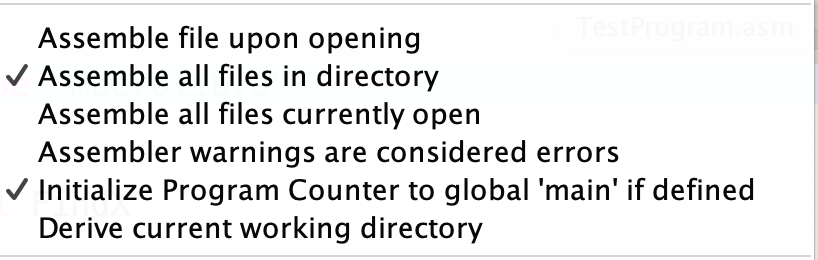

# Хавронич Евгений Алексеевич, БПИ226
### Условие:
Написать подпрограмму, осуществляющую копирование строки символов аналогично функции strcpy языка программирования C. 
Протестировать функцию на различных комбинациях данных. Ознакомиться с функцией можно в системе справки по библиотеке языка C, которая имеется в различных источниках информации. 
Исходные данные для тестирования задавать как при вводе с консоли, так и с использованием строк символов в разрабатываемой программе (по аналогии с программами, рассмотренными на семинаре). 
Подпрограмму вынести в отдельный файл. 
Дополнительно к подпрограмме разработать соответствующий макрос, расширив тем самым макробиблиотеку строк символов.
### Задание выполнено на 10 баллов
### Программы:
[Программы на ассемблере с комментариями размещены здесь](Files)

Для запуска необходимо открыть файл [Main.asm](Files/Main.asm) и убедиться, что во вкладке settings проставлены следующие галочки:

Это необходимо для корректной работы global меток.
После этого запускаем сборку данного файла и следуем требованиям программы в консоли.
### Алгоритм главной программы:
Первый блок предназначен для проверки выполнения подпрограммы [strcpy](Files/strcpy.s) при работе со строкой, введённой пользователем с клавиатуры.
1. Выводится строка о просьбе ввода строки, которая будет копироваться;
2. Ожидается ввод строки, содержащей не более 100 символов;
3. Перемещаем указатели строк в нужные регистры для вызова подпрограммы;
4. Вызывается подпрограмма strcpy
5. Выводится в консоль строка, которая сохранилась после копирования в неё изначальной введённой нами строки.

Так как код не имеет сложных моментов, то комментарий присутствует только на вызове подпрограммы с пояснением, что мы отдаём подпрограмме в регистрах a0 и a1.

Второй блок предназначен для проверки макроса strcpy, поэтому он отличается от первого блока только 4-ым пунктом, где мы будем вызывать макрос strcpy вместо подпрограммы strcpy. Передаваемые в макрос параметры аналогичны аргументам подпрограммы strcpy
Макрос strcpy расположен в [macro-string.m](Files/MacroLib/macro-string.m)

Третий и 4-ый блоки проверяют работу подпрограммы и макроса на строках, которые уже расположены в секции .data. В каждом блоке проверяется подпрограмма strcpy и макрос strcpy – алгоритмы аналогичны первому и вторым пунктам, за исключением 1-ого и 2-ого пункта – вместо них мы просто будем выводить строку, которую сохранили в .data.

### Алгоритм подпрограммы и макроса:
1. Получаем метку, в которую будем копировать данные и метку, откуда будем копировать.
2. В цикле посимвольно копируем данные из второго параметра в первый, пока не встретим символ окончания строки.
3. Добавляем в метку, куда мы копировали, символ окончания строки и завершаем работу подпрограммы(макроса).

### Таблица прогона полного тестового покрытия
Она была составлена при помощи использования блоков с вводом строки через клавиатуру + взят тест из блока, где нам уже дана строка, но в её центре располагается символ окончания строки.
<table>
    <tr>
        <th>№ теста</th>
        <th>Какую ситуацию проверяет</th>
        <th>Введённая строка</th>
        <th>Скопированная строка </th>
        <th>Результат аналогичен тому, если бы мы применяли strcpy из C языка? </th>
    </tr>
    <tr>
        <td>1</td>
        <td>Вводится пустая строка</td>
        <td></td>
        <td></td>
        <td>Да</td>
    </tr>
    <tr>
        <td>2</td>
        <td>Обычная строка</td>
        <td>London is the capital of Great Britain</td>
        <td>London is the capital of Great Britain</td>
        <td>Да</td>
    </tr>
    <tr>
        <td>4</td>
        <td>Строка, внутри которой есть символ окончания строки (тест взят из самой программы)</td>
        <td>Waiit \0 stop</td>
        <td>Waiit</td>
        <td>Да, так как выполнение копирования метода strcpy в Си завершается путём встречи символа окончания строки, то есть все символы после него не сохраняются в скопированную строку</td>
    </tr>
</table>
